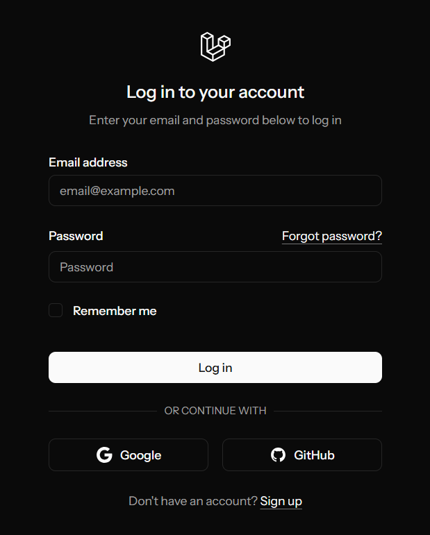
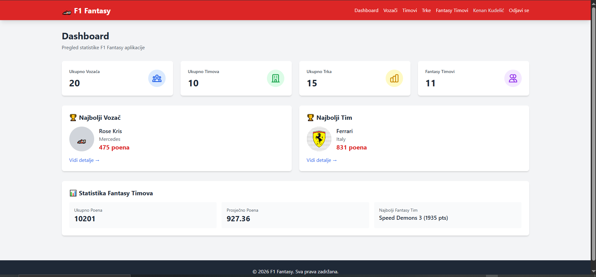
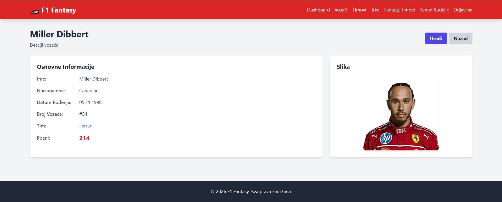
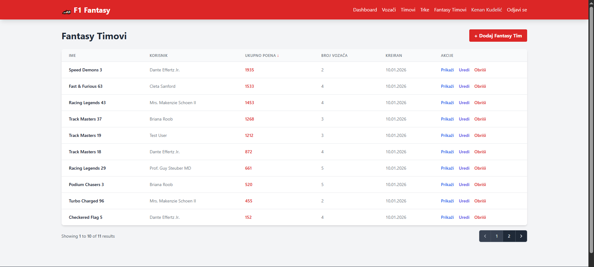
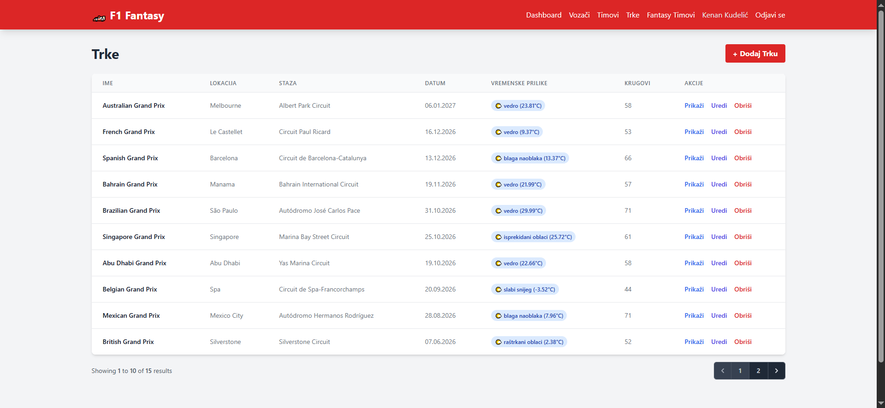
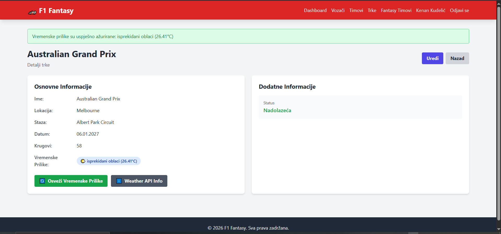
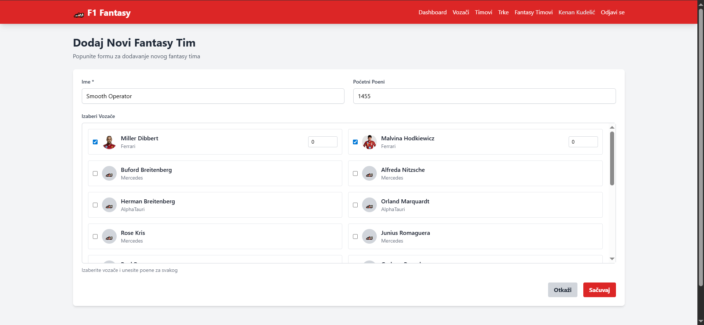

# Migracija baze podataka u aplikaciji Formula 1 Fantasy: od MySQL-a ka PostgreSQL-u i perspektiva MongoDB-a


## 1. Pregled aplikacije


<!-- ========== SLIKE APLIKACIJE ========== -->

**Slika 1: Naslovna stranica / prijava**



---

**Slika 2: Dashboard – pregled statistika**



---

**Slika 3: Prikaz vozača**



---

**Slika 4: Fantasy timovi**



---

**Slika 5: Trke**



---

**Slika 6: Detalj trke sa vremenskim podacima (Weather API)**



---

**Slika 7: Dodavanje novog fantasy tima**



<!-- ========== KRAJ SLIKA ========== -->

---


---

## 2. Migracija sa MySQL-a na PostgreSQL


### Koraci izvršene migracije

Migracija je izvršena u sljedećim koracima.

**Korak 1 – Instalacija i priprema PostgreSQL-a**  
Na ciljnoj mašini je instaliran PostgreSQL (npr. sa zvaničnog sajta za Windows, putem paketnog menadžera na Linuxu ili Homebrew na macOS-u). Kreirani su korisnik i baza podataka namijenjeni aplikaciji, npr. u `psql`:

```sql
CREATE USER fantasyf1 WITH PASSWORD 'tajna_lozinka';
CREATE DATABASE fantasyf1 OWNER fantasyf1;
```

**Korak 2 – PHP ekstenzija**  
Laravel za pristup PostgreSQL-u koristi PDO driver `pdo_pgsql`. U okruženju je provjereno da je ekstenzija uključena u `php.ini` (`extension=pdo_pgsql`). U suprotnom, nakon uključivanja ekstenzije i ponovnog pokretanja web servera, konekcija na PostgreSQL postaje moguća.

**Korak 3 – Konfiguracija aplikacije**  
U konfiguracionom fajlu okruženja (`.env`) postavljene su vrijednosti za PostgreSQL konekciju:

```env
DB_CONNECTION=pgsql
DB_HOST=127.0.0.1
DB_PORT=5432
DB_DATABASE=fantasyf1
DB_USERNAME=fantasyf1
DB_PASSWORD=tajna_lozinka
```

Laravel u `config/database.php` već sadrži definiciju konekcije za `pgsql`, tako da nije bilo potrebno mijenjati konfiguracione fajlove u repozitorijumu.

**Korak 4 – Izvršavanje migracija i seed podataka**  
Nakon čišćenja keša konfiguracije (`php artisan config:clear`), izvršene su migracije (`php artisan migrate`) i seedovanje početnih podataka (`php artisan db:seed`). Sve postojeće migracije (tabele `users`, `teams`, `drivers`, `races`, `fantasy_teams`, `fantasy_team_drivers`, kao i tabele za sesiju, cache i queue) uspješno su kreirane u PostgreSQL bazi. Nije bilo potrebe za ručnim SQL skriptama niti za izmjenom migracionih fajlova.

**Korak 5 – Verifikacija**  
Aplikacija je pokrenuta u razvojnom okruženju; sve funkcionalnosti (autentifikacija, CRUD operacije, dashboard, REST API, integracija sa OpenWeatherMap) radile su identično kao na MySQL-u.

---

## 3. Perspektiva migracije na MongoDB

### 3.1 Razlika u modelu podataka

MongoDB pripada porodici dokumentnih (NoSQL) baza. Podaci se čuvaju u kolekcijama u obliku JSON-like dokumenta (BSON). Ne postoji fiksna shema na nivou baze; relacije između entiteta ne modeluju se stranim ključevima, već ugnežđivanjem ili referencama (npr. ObjectId). Stoga prelazak sa relacionog modela na MongoDB zahtijeva promjenu načina na koji se podaci modeluju i do kojih se pristupa u kodu.

### 3.2 Kako bi aplikacija izgledala u MongoDB-u

U dokumentnom modelu, entiteti aplikacije mapiraju se na kolekcije. Pivot tabela za many-to-many vezu (fantasy tim – vozač) više ne postoji kao posebna tabela; informacija se može čuvati ugnežđeno u dokumentu fantasy tima ili u posebnoj kolekciji referenci.

**Kolekcije:**  
`users`, `drivers`, `teams`, `races`, `fantasy_teams`; opciono i kolekcija za vezu fantasy_team–vozač ako se ne koristi ugnežđeni niz.

**Primjer dokumenta u kolekciji `drivers`:**

```json
{
  "_id": ObjectId("..."),
  "name": "Lewis Hamilton",
  "nationality": "British",
  "date_of_birth": ISODate("1985-01-07"),
  "team_id": ObjectId("..."),
  "points": 250,
  "photo": "drivers/abc.jpg",
  "driver_number": "44",
  "created_at": ISODate("..."),
  "updated_at": ISODate("...")
}
```

Polje `team_id` predstavlja referencu na dokument u kolekciji `teams`; „spajanje“ (join) izvršilo bi se u aplikacionom sloju (dva upita ili MongoDB agregacija sa `$lookup`).

**Primjer dokumenta u kolekciji `fantasy_teams` sa ugnježdeni vozačima:**

```json
{
  "_id": ObjectId("..."),
  "user_id": ObjectId("..."),
  "name": "Moja Fantasy Ekipa",
  "total_points": 380,
  "drivers": [
    { "driver_id": ObjectId("..."), "points": 200 },
    { "driver_id": ObjectId("..."), "points": 180 }
  ],
  "created_at": ISODate("..."),
  "updated_at": ISODate("...")
}
```

Many-to-many veza između fantasy timova i vozača ovdje je modelovana ugnežđenim nizom; alternativno može postojati posebna kolekcija sa dokumentima koji sadrže `fantasy_team_id`, `driver_id` i `points`.

### 3.3 Izmjene u aplikacionom sloju

U slučaju prelaska na MongoDB, potrebno bi bilo:

- **Modeli:** koristiti driver za MongoDB (npr. Laravel MongoDB paket kao što je `jenssegers/mongodb`) i prilagoditi modele dokumentnom modelu (kolekcije, ObjectId, ugnežđeni nizovi/reference).
- **Upiti:** zamijeniti SQL (SELECT, JOIN, GROUP BY) MongoDB upitima (find, aggregate, $lookup); Eloquent bi se koristio u okviru mogućnosti MongoDB paketa.
- **Migracije:** Laravelove SQL migracije nisu primjenjive; shema (kolekcije, indeksi) definirala bi se u kodu ili ručno u MongoDB-u; seederi pisali bi dokumente u kolekcije.
- **Integritet:** MongoDB ne podržava strane ključeve; referentni integritet i cascade ponašanje morali bi da se implementiraju u aplikaciji (npr. observeri, servisni sloj).


Funkcionalno, korisnički interfejs i REST API mogli bi ostati isti; promijenio bi se isključivo sloj pristupa podacima (modeli, repozitorijumi, upiti).

---

## 4. Zašto se ne može samo „prebaciti“ na MongoDB

Za razliku od prelaska sa MySQL-a na PostgreSQL, gdje su oba sistema relacioni i podržavaju isti konceptualni model i SQL (uz manje sintaksne razlike), prelazak na MongoDB zahtijeva promjenu paradigme:

1. **Eloquent i SQL:** Trenutni modeli koriste Eloquent sa PDO driverom za MySQL/PostgreSQL i generiraju SQL. MongoDB ne izvršava SQL; potreban je drugi driver i druga vrsta upita (npr. preko Laravel MongoDB paketa).
2. **Migracije:** Sve postojeće migracije su SQL (CREATE TABLE, FOREIGN KEY, indeksi). U MongoDB-u nema tabela ni stranih ključeva; migracije bi morale biti zamijenjene ili dopunjene definicijama kolekcija i indeksa u MongoDB sintaksi.
3. **Pivot tabela i relacije:** Tabela `fantasy_team_drivers` i logika attach/sync/detach u kontrolerima zasnovani su na relacionom modelu. U MongoDB-u bi ova logika bila prilagođena ugnježdeni dokumentima ili posebnoj kolekciji bez FK ograničenja.
4. **Referentni integritet:** Cascade brisanje i provjera referenci trenutno su djelimično delegirani bazi (FK). U MongoDB-u bi ovo moralo da se riješi u aplikacionom kodu.
5. **Sesija, keš, redovi:** Ako su podešeni na `database`, očekuju SQL tabele; za čisto MongoDB okruženje potrebna je druga konfiguracija ili posebna podrška za te dijelove.

Stoga se ne može reći da se aplikacija „prebacuje“ na MongoDB samo promjenom connection stringa u `.env`; potreban je namjenski refaktor sloja za pristup podacima (modeli, upiti, „migracije“, logika relacija i integriteta).


---

## Reference

1. Laravel. *Database: Getting Started*. https://laravel.com/docs/database  
2. Laravel. *Eloquent ORM*. https://laravel.com/docs/eloquent  
3. PostgreSQL. *PostgreSQL Documentation*. https://www.postgresql.org/docs/  
4. MongoDB. *MongoDB Documentation*. https://www.mongodb.com/docs/  
5. Jenssegers. *Laravel MongoDB*. https://github.com/jenssegers/laravel-mongodb  
